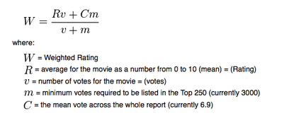
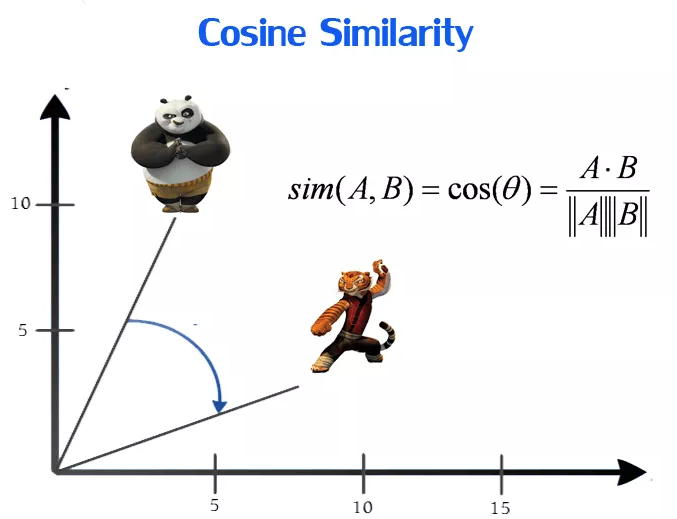

# <b>Content Based Recommendation System</b>

## <b><u>Dataset</u></b>

<b><a href="https://www.kaggle.com/tmdb/tmdb-movie-metadata" style="font-size:15px;">TMDB 5000 Movie Dataset</a></b>

The first dataset(tmdb_5000_credits.csv) contains the following features:-

- movie_id - A unique identifier for each movie.
- cast - The name of lead and supporting actors.
- crew - The name of Director, Editor, Composer, Writer etc.

The second dataset(tmdb_5000_movies.csv) has the following features:-

- budget - The budget in which the movie was made.
- genre - The genre of the movie, Action, Comedy ,Thriller etc.
- homepage - A link to the homepage of the movie.
- id - This is infact the movie_id as in the first dataset.
- keywords - The keywords or tags related to the movie.
- original_language - The language in which the movie was made.
- original_title - The title of the movie before translation or adaptation.
- overview - A brief description of the movie.
- popularity - A numeric quantity specifying the movie - popularity.
- production_companies - The production house of the movie.
- production_countries - The country in which it was produced.
- release_date - The date on which it was released.
- revenue - The worldwide revenue generated by the movie.
- runtime - The running time of the movie in minutes.
- status - "Released" or "Rumored".
- tagline - Movie's tagline.
- title - Title of the movie.
- vote_average - average ratings the movie recieved.
- vote_count - the count of votes recieved.

## <b><u>Weighted Average Rating Based Recommendation System</u></b>

- we need a metric to score or rate movie
- Calculate the score for every movie
- Sort the scores and recommend the best rated movie to the users.

We can use the average ratings of the movie as the score but using this won't be fair enough since a movie with 8.9 average rating and only 3 votes cannot be considered better than the movie with 7.8 as as average rating but 40 votes. Hence we will be using Weighted Average Rating which is given as :-

 

## <b><u>Overview(Plot) Based Recommendation System</u></b>
In this, we use the "Overview" column for each movie and use it to find similar movies to the chosen movie.
1. Clean "Overview" column 
2. Sklearn's TfidfVectorizer - to convert "Overview" column text into a vector 
3. Sklearn's sigmoid_kernel - to find the similarity matrix 

## <b><u>Genres,Keywords,Cast and Crew Based Recommendation System</u></b>
In this, we use the "Genres","Keywords","Cast" and "Crew" columns for each movie and use it to find similar movies to the chosen movie.
1. Clean "Genres","Keywords","Cast" and "Crew" columns and get it in appropriate format 
2. Get the director name from the "Crew" column  
3. Create new column named "Soup" which is a concatenation of "Genres","Keywords","Cast" and "Director" columns 
4. Sklearn's CountVectorizer - to convert "Soup" column text into a vector 
3. Sklearn's cosine_similarity - to find the similarity matrix 

 

