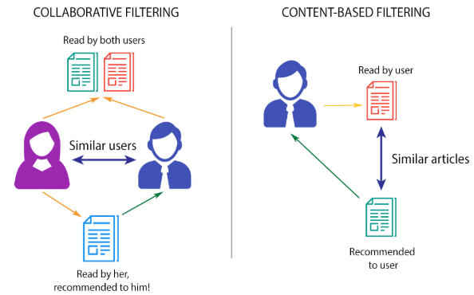

# <b style="color:white;">Recommendation Systems</b>

The rapid growth of data collection has led to a new era of information. Data is being used to create more efficient systems and this is where Recommendation Systems come into play. Recommendation Systems are a type of information filtering systems as they improve the quality of search results and provides items that are more relevant to the search item or are related to the search history of the user.

They are used to predict the rating or preference that a user would give to an item. Almost every major tech company has applied them in some form or the other: Amazon uses it to suggest products to customers, YouTube uses it to decide which video to play next on autoplay, and Facebook uses it to recommend pages to like and people to follow. Moreover, companies like Netflix and Spotify depend highly on the effectiveness of their recommendation engines for their business and success.

All the major companies that use Recommendation Systems generally have their own algorithm to predict the best recommendations.These algorithms may or may not be very complicated.

In this repository,we shall take a look at the very basic algorithms used by Recommendation Systems.

 

## <u><b><a href="https://github.com/yashjhaveri05/Recommendation-System/tree/main/ContentBased" style=color:white;>Content Based</a></b></u>

They suggest similar items based on a particular item. This system uses item metadata, such as genre, director, description, actors, etc. for movies, to make these recommendations. The general idea behind these recommender systems is that if a person liked a particular item, he or she will also like an item that is similar to it.

<b>Advantages</b>

- The model doesn't need any data about other users, since the recommendations are specific to this user. This makes it easier to scale to a large number of users.
- The model can capture the specific interests of a user, and can recommend niche items that very few other users are interested in.

<b>Disadvantages</b>

- Since the feature representation of the items are hand-engineered to some extent, this technique requires a lot of domain knowledge. Therefore, the model can only be as good as the hand-engineered features.
- The model can only make recommendations based on existing interests of the user. In other words, the model has limited ability to expand on the users' existing interests.

## <u><b><a href="https://github.com/yashjhaveri05/Recommendation-System/tree/main/CollaborativeFilteringBased" style=color:white;>Collaborative Filtering</a></b></u>

This system matches persons with similar interests and provides recommendations based on this matching. Collaborative filters do not require item metadata like its content-based counterparts.

<b>Advantages</b>

- No domain knowledge necessary: We don't need domain knowledge because the embeddings are automatically learned.
- Serendipity: The model can help users discover new interests. In isolation, the ML system may not know the user is interested in a given item, but the model might still recommend it because similar users are interested in that item.
- Great starting point: To some extent, the system needs only the feedback matrix to train a matrix factorization model. In particular, the system doesn't need contextual features. In practice, this can be used as one of multiple candidate generators.

<b>Disadvantages</b>

- Cannot handle fresh items
- Hard to include side features for query/item

## <b style="color:white;">Tech Stack</b>

> Python 
> Pandas 
> Numpy 
> Matplotlib and Seaborn 
> Scipy 
> Sklearn 

## <b style="color:white;">Resources</b>

> <a href="https://developers.google.com/machine-learning/recommendation">Recommendation System Blog by Google</a> 
> <a href="https://www.youtube.com/playlist?list=PLZoTAELRMXVN7QGpcuN-Vg35Hgjp3htvi">Krish Naik Recommendation System Playlist</a> 
> <a href="https://towardsdatascience.com/intro-to-recommender-system-collaborative-filtering-64a238194a26">Introduction to Recommender System Blog</a> 
> <a href="https://thecleverprogrammer.com/2021/02/10/content-based-filtering-in-machine-learning/">Content-Based Filtering in Machine Learning Blog</a> 

## <b style="color:white;">App Info</b>

### Author [Yash Jhaveri](https://www.linkedin.com/in/yash-jhaveri-3b0882192/)